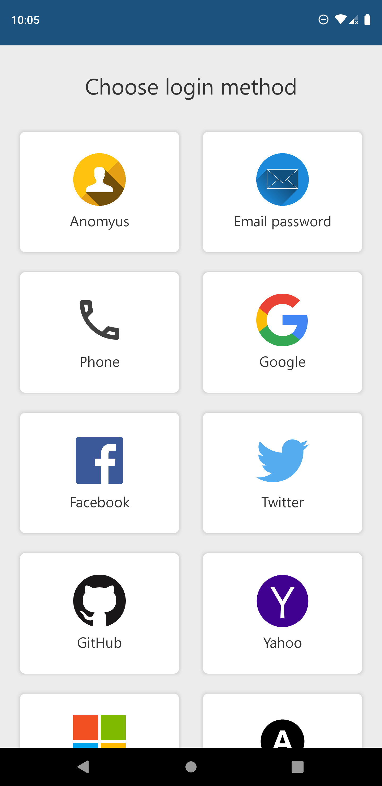
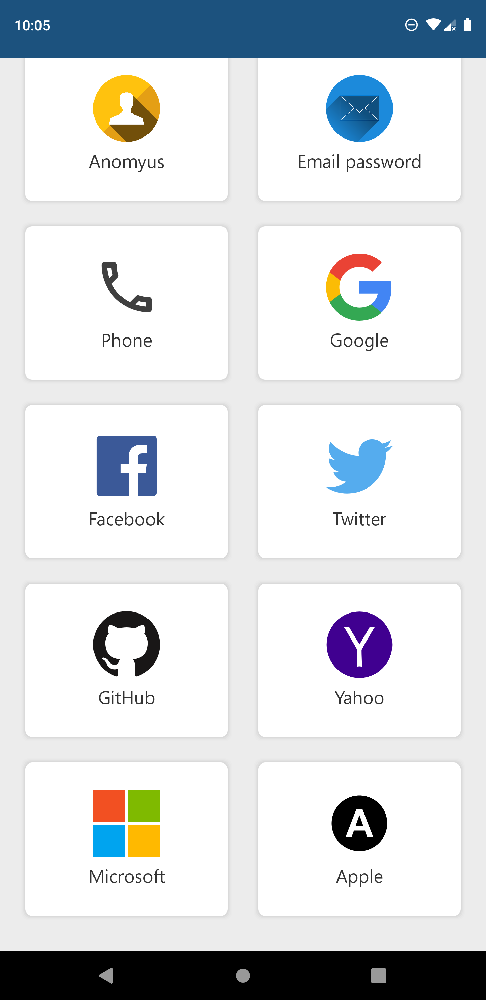
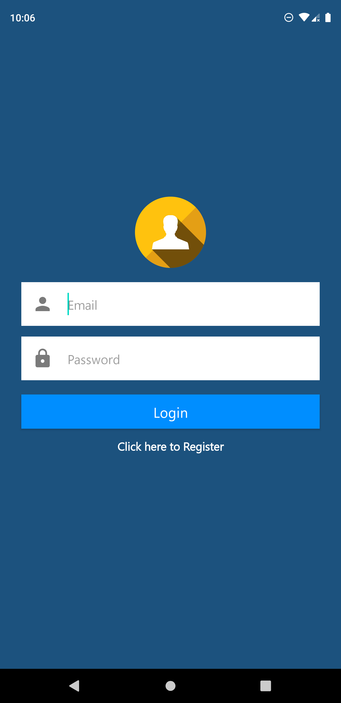
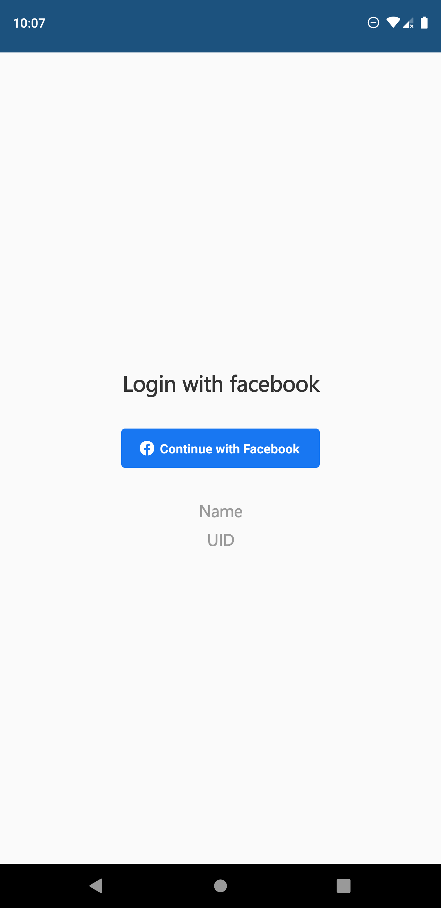
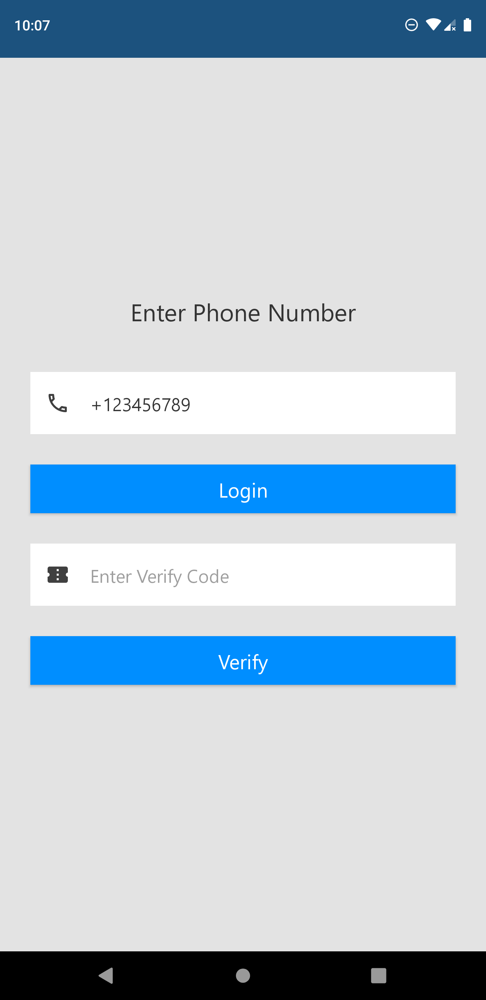
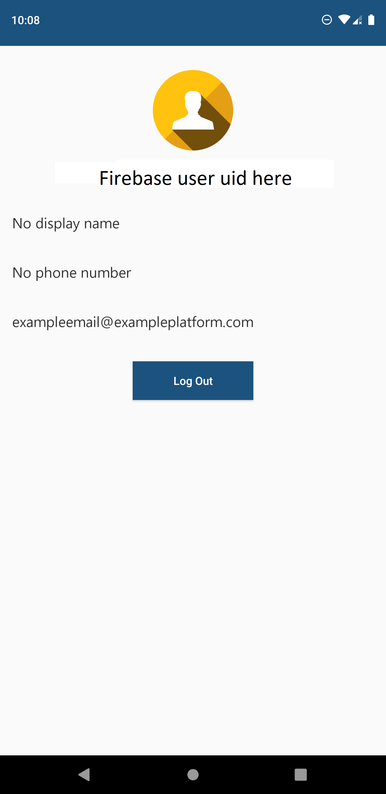

# All firebase google auth login methods in one app

A new Kotlin application.
#### Login Methods App using Firebase Authenticate 

## Getting Started


A few resources to get you started if this is your first kotlin project:
- [getting started with kotlin](https://kotlinlang.org/docs/tutorials/getting-started.html)
- [kotlin codelabs](https://codelabs.developers.google.com/android-kotlin-fundamentals/)


## **Anonymous Login**


**documentation** - [Anonymous login documentation](https://firebase.google.com/docs/auth/android/anonymous-auth?hl=en)


#### Example login code from documentation


```kotlin
auth.signInAnonymously()
        .addOnCompleteListener { task ->
            if (task.isSuccessful) {
                val user = auth.currentUser
                updateUI(user)
            } else {
                Toast.makeText(baseContext, "Authentication failed.", Toast.LENGTH_SHORT).show()
                updateUI(null)
            }
        }
```

## **Login with email and password**


**documentation** - [Email and password login documentation](https://firebase.google.com/docs/auth/android/password-auth?hl=en)


#### Example register code from documentation


```kotlin
auth.createUserWithEmailAndPassword(email, password)
        .addOnCompleteListener { task ->
            if (task.isSuccessful) {
                val user = auth.currentUser
                updateUI(user)
            } else {
                Toast.makeText(baseContext, "Authentication failed.",
                        Toast.LENGTH_SHORT).show()
                updateUI(null)
            }

        }
```


#### Login method from documentation
```kotlin
auth.signInWithEmailAndPassword()
```


## **Login with phone number**


**documentation** - [Phone number login documentation](https://firebase.google.com/docs/auth/android/phone-auth?hl=en)


#### Create credential method from documentation
```kotlin

var storedVerificationId: String? = null
var resendToken : PhoneAuthProvider? = null

callbacks = object : PhoneAuthProvider.OnVerificationStateChangedCallbacks() {

    override fun onVerificationCompleted(credential: PhoneAuthCredential) {
        signInWithPhoneAuthCredential(credential)
    }

    override fun onVerificationFailed(e: FirebaseException) { }

    override fun onCodeSent(verificationId: String,token: PhoneAuthProvider.ForceResendingToken  ) {
        storedVerificationId = verificationId
        resendToken = token
    }
}


PhoneAuthProvider.getInstance().verifyPhoneNumber(
        phoneNumber, // Phone number to verify
        60, // Timeout duration
        TimeUnit.SECONDS, // Unit of timeout
        this, // Activity (for callback binding)
        callbacks) // OnVerificationStateChangedCallbacks

val credential = PhoneAuthProvider.getCredential(verificationId!!, code)

```


#### Example login code from documentation


```kotlin
private fun signInWithPhoneAuthCredential(credential: PhoneAuthCredential) {
    auth.signInWithCredential(credential)
            .addOnCompleteListener { task ->
                if (task.isSuccessful) {
                    val user = task.result?.user
                    updateUI(user)
                } else {
                    Log.w(TAG, "signInWithCredential:failure", task.exception)
                    updateUI(null)
                }
            }
}
```


## **Login with google account**


**documentation** - [Google login documentation](https://firebase.google.com/docs/auth/android/google-signin?hl=en)


#### Example login code from documentation


```kotlin
val gso = GoogleSignInOptions.Builder(GoogleSignInOptions.DEFAULT_SIGN_IN)
        .requestIdToken(getString(R.string.default_web_client_id))
        .requestEmail()
        .build()

private fun signIn() {
    val signInIntent = googleSignInClient.signInIntent
    startActivityForResult(signInIntent, RC_SIGN_IN)
}

override fun onActivityResult(requestCode: Int, resultCode: Int, data: Intent?) {
    super.onActivityResult(requestCode, resultCode, data)

    if (requestCode == RC_SIGN_IN) {
        val task = GoogleSignIn.getSignedInAccountFromIntent(data)
        try {
            val account = task.getResult(ApiException::class.java)!!
            firebaseAuthWithGoogle(account.idToken!!)
        } catch (e: ApiException) {}
    }
}

private fun firebaseAuthWithGoogle(idToken: String) {
    val credential = GoogleAuthProvider.getCredential(idToken, null)
    auth.signInWithCredential(credential)
            .addOnCompleteListener { task ->
                if (task.isSuccessful) {
                    val user = auth.currentUser
                    updateUI(user)
                } else {
                    Snackbar.make(view, "Authentication Failed.", Snackbar.LENGTH_SHORT).show()
                    updateUI(null)
                }
            }
}
```


## **Login with Facebook**


**documentation** - [Facebook login documentation](https://firebase.google.com/docs/auth/android/facebook-login?hl=en)
**register your app in Facebook** - [Facebook for developers](https://developers.facebook.com/docs/facebook-login/android)


#### Example login code from documentation


```kotlin
callbackManager = CallbackManager.Factory.create()

binding.buttonFacebookLogin.setReadPermissions("email", "public_profile")
binding.buttonFacebookLogin.registerCallback(callbackManager, object : FacebookCallback<LoginResult> {
    override fun onSuccess(loginResult: LoginResult) {
        handleFacebookAccessToken(loginResult.accessToken)
    }

    override fun onCancel() {
    }

    override fun onError(error: FacebookException) {
    }
})


override fun onActivityResult(requestCode: Int, resultCode: Int, data: Intent?) {
    super.onActivityResult(requestCode, resultCode, data)
    callbackManager.onActivityResult(requestCode, resultCode, data)
}


private fun handleFacebookAccessToken(token: AccessToken) {

    val credential = FacebookAuthProvider.getCredential(token.token)
    auth.signInWithCredential(credential)
            .addOnCompleteListener { task ->
                if (task.isSuccessful) {
                    val user = auth.currentUser
                    updateUI(user)
                } else {
                    Toast.makeText(baseContext, "Authentication failed.",Toast.LENGTH_SHORT).show()
                    updateUI(null)
                }
            }
}
```


## **Login with Twitter**


**documentation** - [Twitter login documentation](https://firebase.google.com/docs/auth/android/twitter-login?hl=en)
**register your app in Twitter** - [Twitter for developers](https://developer.twitter.com/en)


#### Example login code from documentation


```kotlin

val provider : OAuthProvider.Builder = OAuthProvider.newBuilder("twitter.com")
loginWithTwitter(provider)

fun loginWithTwitter(provider: OAuthProvider.Builder){
        auth.startActivityForSignInWithProvider(activity,provider.build())
            .addOnSuccessListener { authResult ->
                updateUI(auth.currentUser!!)
            }
            .addOnFailureListener {
                updateUI(null)
            }
    }

```


## **Login with Github**


**documentation** - [Github login documentation](https://firebase.google.com/docs/auth/android/github-auth?hl=en)
**register your app in Github** - [Github for developers](https://github.com/settings/applications/new)


#### Example login code from documentation


```kotlin

val provider : OAuthProvider.Builder = OAuthProvider.newBuilder("github.com")
loginWithGithub(provider)

fun loginWithGithub(provider: OAuthProvider.Builder){
        auth.startActivityForSignInWithProvider(activity,provider.build())
            .addOnSuccessListener { authResult ->
                updateUI(auth.currentUser!!)
            }
            .addOnFailureListener {
                updateUI(null)
            }
    }


```

## **Login with Yahoo**


**documentation** - [Yahoo login documentation](https://firebase.google.com/docs/auth/android/yahoo-oauth?hl=en)
**register your app in Yahoo** - [Yahoo for developers](https://developer.yahoo.com/oauth2/guide/openid_connect/getting_started.html)


#### Example login code from documentation


```kotlin

val provider : OAuthProvider.Builder = OAuthProvider.newBuilder("yahoo.com")
loginWithYahoo(provider)

fun loginWithYahoo(provider: OAuthProvider.Builder){
        auth.startActivityForSignInWithProvider(activity,provider.build())
            .addOnSuccessListener { authResult ->
                updateUI(auth.currentUser!!)
            }
            .addOnFailureListener {
                updateUI(null)
            }
    }


```


## **Login with Microsoft**


**documentation** - [Microsoft login documentation](https://firebase.google.com/docs/auth/android/microsoft-oauth?hl=en)
**register your app in Microsoft** - [Microsoft for developers](https://docs.microsoft.com/en-us/azure/active-directory/develop/quickstart-register-app)


#### Example login code from documentation


```kotlin

val provider : OAuthProvider.Builder = OAuthProvider.newBuilder("microsoft.com")
loginWithMicrosoft(provider)

fun loginWithMicrosoft(provider: OAuthProvider.Builder){
        auth.startActivityForSignInWithProvider(activity,provider.build())
            .addOnSuccessListener { authResult ->
                updateUI(auth.currentUser!!)
            }
            .addOnFailureListener {
                updateUI(null)
            }
    }


```


## **Login with Apple**


**documentation** - [Apple login documentation](https://firebase.google.com/docs/auth/android/apple?hl=en)
**register your app in Apple** - [Apple for developers](https://developer.apple.com/)


#### Example login code from documentation


```kotlin

val provider : OAuthProvider.Builder = OAuthProvider.newBuilder("apple.com")
loginWithApple(provider)

fun loginWithApple(provider: OAuthProvider.Builder){
        auth.startActivityForSignInWithProvider(activity,provider.build())
            .addOnSuccessListener { authResult ->
                updateUI(auth.currentUser!!)
            }
            .addOnFailureListener {
                updateUI(null)
            }
    }


```


## Screenshots :









## Thanks for reading. Don't forget to star my project 